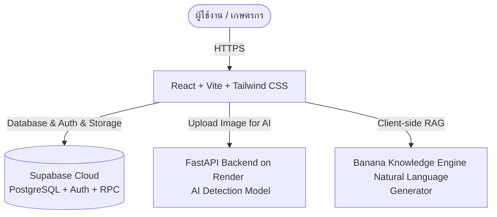

# 🍌 Banana Expert

<div align="center">


<p align="center">
  <b>แพลตฟอร์มจำแนกสายพันธุ์กล้วยด้วย AI • ตลาดจองผลผลิตล่วงหน้าตรงจากฟาร์ม • และ Banana Assistant AI Chatbot</b>
</p>

</div>

---

## 🌟Core Features

### 🔍 1. AI-Powered Variety & Disease Detection 
- อัปโหลดหรือถ่ายภาพใบกล้วย ผลกล้วย หรือต้นกล้วย
- ระบบประมวลผลผ่านโมเดล AI เพื่อจำแนกสายพันธุ์และประเมินโรคพืช พร้อมเปอร์เซ็นต์ความมั่นใจ (Confidence Score)
- ให้คำแนะนำการดูแลรักษาและการกำจัดโรคพืชแบบตรงจุด

### 📖 2. Banana Knowledge Base
- รวบรวมข้อมูลกล้วยกว่า 10 สายพันธุ์ยอดนิยมและหายากในประเทศไทย (กล้วยหอมทอง, น้ำว้า, ไข่, เล็บมือนาง, หักมุก ฯลฯ)
- มีระบบค้นหา Real-time ค้นหาได้ทั้งชื่อไทย ชื่อวิทยาศาสตร์ ลักษณะผล และสรรพคุณ
- แนะนำสภาพดิน สภาพแดด สูตรปุ๋ย และระยะเวลาเก็บเกี่ยวที่เหมาะสม

### 🛒 3. Smart Marketplace & Pre-order
- ระบบสั่งจองผลผลิตล่วงหน้า (Pre-order / Reservation) จากเกษตรกรผู้ปลูกโดยตรง
- ระบบจัดการสต็อกแบบ Real-time ด้วย Database Atomic RPC ป้องกันการสั่งจองเกินจำนวน
- แสดงสถานะออนไลน์ของฟาร์ม และระบบรีวิว/ให้คะแนนฟาร์มอย่างโปร่งใส

### 💬 4. Banana Assistant Chatbot
- ตอบคำถามเรื่องสายพันธุ์กล้วย, การดูแล, สูตรปุ๋ย, และวิธีแก้ปัญหาโรคพืช
- แนะนำขั้นตอนการใช้งานเว็บไซต์และการเปิดร้านค้าฟาร์ม
- สื่อสารด้วยภาษาไทยธรรมชาติ นุ่มนวล สุภาพ และทำงานแบบ Client-side 100%

### 🚜 5. Farm & User Management
- **สำหรับผู้ซื้อ**: ตรวจสอบประวัติการสั่งจอง, ติดตามสถานะจัดส่ง, ให้คะแนนรีวิวฟาร์ม
- **สำหรับฟาร์ม**: Dashboard จัดการสินค้า, เพิ่ม/แก้ไขสินค้า, จัดการออเดอร์, และอัปเดตเลขพัสดุ (Tracking Number)

---

## 🏗️ System Architecture



---

## 🛠️ Tech Stack

| ส่วนของระบบ | เทคโนโลยีที่ใช้ |
|---|---|
| **Frontend** | React 18, TypeScript, Vite, Tailwind CSS, shadcn/ui, Lucide Icons, Sonner |
| **State & Query** | TanStack React Query, React Router DOM v6 |
| **Backend & DB** | Supabase (PostgreSQL, Row Level Security, RPC Functions, GoTrue Auth) |
| **AI Inference** | Python, FastAPI, PyTorch / Computer Vision Models |
| **Deployment** | Vercel (Frontend), Render (AI Backend), Supabase Cloud (Database) |

---

## 📂 Project Structure

```text
banana-expert-update/
├── api/                       # Vercel Serverless Function Proxy
├── public/                    # Static Assets & Icons
├── src/
│   ├── assets/                # รูปภาพประกอบ และ Hero Banner
│   ├── components/
│   │   ├── chat/              # BananaChatbot Component
│   │   ├── layout/            # Navbar, NavLink, ScrollToTop
│   │   └── ui/                # shadcn/ui Components (Button, Card, Dialog ฯลฯ)
│   ├── integrations/
│   │   └── supabase/          # Supabase Client Configuration
│   ├── lib/
│   │   ├── chatbot-knowledge.ts # Knowledge Engine & Response Generator
│   │   └── utils.ts           # Utility Functions (cn, clsx)
│   ├── pages/
│   │   ├── auth/              # Auth (Login, Sign up), ResetPassword
│   │   ├── farm/              # Farm Dashboard, Add/Edit Product, Farm Orders
│   │   ├── user/              # User Dashboard, Orders, UpdateProfile
│   │   ├── CultivarDetail.tsx # หน้ารายละเอียดสายพันธุ์กล้วย
│   │   ├── Index.tsx          # หน้าแรก และระบบสแกน AI Detection
│   │   ├── Knowledge.tsx      # หน้าคลังความรู้สายพันธุ์กล้วย
│   │   ├── Market.tsx         # หน้าตลาดซื้อขายผลผลิต
│   │   ├── NotFound.tsx       # 404 Error Page
│   │   └── ProductDetail.tsx  # หน้ารายละเอียดสินค้าและแบบฟอร์มจอง
│   ├── App.tsx                # Application Routing
│   ├── index.css              # Global Styling & Theme Variables
│   └── main.tsx               # Application Entry Point
└── supabase/
    └── migrations/            # SQL Migrations, Table Schemas & RPC Functions
```

---

## 🚀 Getting Started

### 1. โคลน Repository
```bash
git clone https://github.com/ChanakanChanapai/banana-expert-update.git
cd banana-expert-update
```

### 2. ติดตั้ง Dependencies
```bash
npm install
```

### 3. ตั้งค่า Environment Variables (`.env`)
สร้างไฟล์ `.env` ที่โฟลเดอร์รากของโปรเจกต์:
```env
VITE_SUPABASE_PROJECT_ID="your_project_id"
VITE_SUPABASE_URL="https://your_project.supabase.co"
VITE_SUPABASE_PUBLISHABLE_KEY="your_supabase_anon_key"
VITE_API_BASE_URL="https://banana-deploy.onrender.com"
```

### 4. รัน Development Server
```bash
npm run dev
```
เปิดเบราว์เซอร์แล้วไปที่ **`http://localhost:8080`** (หรือพอร์ตที่แสดงใน Terminal)

### 5. Build สำหรับ Production
```bash
npm run build
```

---

<div align="center">
  <sub>Made with 🍌 for Thai Banana Farmers & Agricultural Community</sub>
</div>
